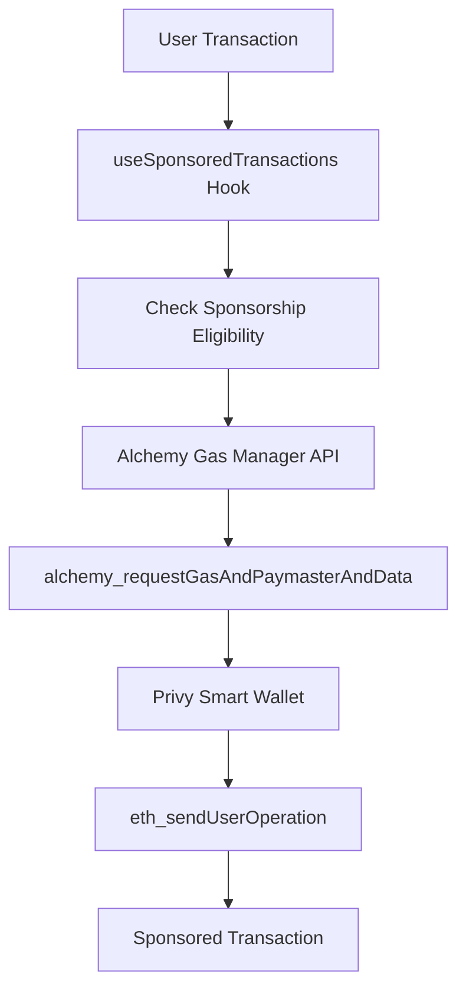

# 🚀 Alchemy Gas Sponsorship Implementation Guide

This implementation follows the **official Alchemy documentation** for gas sponsorship on EVM networks:
- [How to sponsor gas on EVM](https://www.alchemy.com/docs/reference/how-to-sponsor-gas-on-evm) 
- [Create Policy API](https://www.alchemy.com/docs/wallets/api/gas-manager-admin-api/admin-api-endpoints/create-policy)

## 📋 Overview

The implementation provides **proper gas sponsorship** using Alchemy's Gas Manager following the 3-step process:

1. **Create a Gas Manager Policy** (done in Alchemy Dashboard)
2. **Get Gas Manager's signature** (`alchemy_requestGasAndPaymasterAndData`)
3. **Send the sponsored userOp** (`eth_sendUserOperation`)

## 🔧 Architecture



## 🛠️ Implementation Files

### Core Services
- **`lib/alchemy-gas-manager.ts`** - Complete Alchemy Gas Manager API implementation
- **`lib/smart-wallet-utils.ts`** - Smart wallet transaction utilities with sponsorship
- **`app/hooks/useSponsoredTransactions.tsx`** - React hook for sponsored transactions

### Updated Components  
- **`app/providers.tsx`** - Enhanced Privy configuration with Alchemy integration
- **`app/components/send-modal.tsx`** - Updated to use sponsored transaction flow

## ⚙️ Environment Configuration

Create a `.env.local` file with the following variables:

```env
# Privy Configuration (for smart wallet creation and authentication)
NEXT_PUBLIC_PRIVY_APP_ID=your_privy_app_id_here
PRIVY_APP_SECRET=your_privy_app_secret_here

# Alchemy Gas Sponsorship Configuration
# Get these from your Alchemy Dashboard: https://dashboard.alchemy.com
NEXT_PUBLIC_ALCHEMY_API_KEY=your_alchemy_api_key_here
NEXT_PUBLIC_ALCHEMY_POLICY_ID=your_gas_manager_policy_id_here

# Optional: Alchemy App ID (required for creating policies programmatically)
NEXT_PUBLIC_ALCHEMY_APP_ID=your_alchemy_app_id_here
```

## 🔑 Step 1: Create Alchemy Gas Manager Policy

### Using Alchemy Dashboard (Recommended)

1. **Go to [Alchemy Dashboard](https://dashboard.alchemy.com)**
2. **Navigate to "Gas Manager"**
3. **Create a new sponsorship policy**
4. **Configure policy rules**:
   ```json
   {
     "policyName": "Convexo Gas Sponsorship",
     "policyType": "sponsorship",
     "networks": ["ETH_SEPOLIA", "OP_SEPOLIA", "BASE_SEPOLIA"],
     "rules": {
       "maxSpendUsd": "1000.00",
       "maxSpendPerSenderUsd": "50.00", 
       "maxSpendPerUoUsd": "10.00",
       "maxCount": "1000",
       "maxCountPerSender": "10",
       "sponsorshipExpiryMs": "3600000"
     }
   }
   ```

### Using API (Programmatic)

```typescript
import { getGasManager } from '@/lib/alchemy-gas-manager';

const gasManager = getGasManager();

const policy = await gasManager.createPolicy({
  policyName: "Convexo Gas Sponsorship",
  policyType: "sponsorship", 
  appId: process.env.NEXT_PUBLIC_ALCHEMY_APP_ID!,
  networks: ["ETH_SEPOLIA", "OP_SEPOLIA", "BASE_SEPOLIA"],
  rules: {
    maxSpendUsd: "1000.00",
    maxSpendPerSenderUsd: "50.00",
    maxSpendPerUoUsd: "10.00", 
    maxCount: 1000,
    maxCountPerSender: 10,
    sponsorshipExpiryMs: "3600000"
  }
});

console.log('Policy created:', policy.policyId);
```

## 🏦 Step 2: Configure Privy Dashboard

1. **Go to [Privy Dashboard](https://dashboard.privy.io)**
2. **Enable smart wallets** in your app settings
3. **Configure Alchemy as paymaster provider**:
   - **Account Implementation**: LightAccount (Alchemy)
   - **Paymaster URL**: `https://eth-sepolia.g.alchemy.com/v2/YOUR_API_KEY`
   - **Policy ID**: Use the Policy ID from Step 1
4. **Configure supported chains** to match your setup

## 💡 Step 3: Using Sponsored Transactions

### Basic Usage

```typescript
import { useSponsoredTransactions } from '@/app/hooks/useSponsoredTransactions';

export function MyComponent() {
  const { sendSponsoredTransaction, status } = useSponsoredTransactions();

  const handleSend = async () => {
    await sendSponsoredTransaction({
      recipient: '0x742d35cc6270c8532e9e866c06c...',
      amount: '0.1',
      chainId: 11155111, // Ethereum Sepolia
    });

    if (status.isSponsored) {
      console.log('🎉 Transaction was gasless!');
    } else {
      console.log('⚠️ User paid gas');
    }
  };

  return (
    <button onClick={handleSend}>
      Send Sponsored Transaction
    </button>
  );
}
```

### Advanced Usage with Token Transfers

```typescript
// Native ETH transfer (gasless)
await sendSponsoredTransaction({
  recipient: '0x742d35cc6270c8532e9e866c06c...',
  amount: '0.1',
  chainId: 11155111,
});

// ERC-20 token transfer (gasless)
await sendSponsoredTransaction({
  recipient: '0x742d35cc6270c8532e9e866c06c...',
  amount: '100',
  tokenAddress: '0xA0b86a33E6417aCce23dA66eF...',
  decimals: 6, // USDC has 6 decimals
  chainId: 11155111,
});
```

## 🎯 Features

### ✅ Smart Features
- **Automatic gas sponsorship** for eligible transactions
- **Fallback to user-paid gas** when sponsorship unavailable
- **Multi-chain support** (Ethereum, Optimism, Base, Polygon)
- **Both mainnet and testnet** compatibility
- **ERC-20 and native token** transfers

### ✅ Integration Benefits
- **Seamless Privy integration** - no breaking changes
- **Proper error handling** with user-friendly messages
- **Transaction status tracking** (sponsored vs. paid)
- **Real-time eligibility checking**

## 🔍 Monitoring and Debugging

### Check Transaction Status

```typescript
import { useSponsoredTransactions } from '@/app/hooks/useSponsoredTransactions';

const { status, checkSponsorship } = useSponsoredTransactions();

// Check if transaction is eligible for sponsorship
const isEligible = await checkSponsorship({
  recipient: '0x742d35cc6270c8532e9e866c06c...',
  amount: '0.1',
  chainId: 11155111,
});

console.log('Sponsorship eligible:', isEligible);
console.log('Transaction status:', status);
```

### Debug Environment Variables

```typescript
// Add to any component to verify configuration
console.log('Policy ID:', process.env.NEXT_PUBLIC_ALCHEMY_POLICY_ID);
console.log('API Key:', process.env.NEXT_PUBLIC_ALCHEMY_API_KEY ? 'Set' : 'Missing');
```

## 🚨 Troubleshooting

### Common Issues

1. **"Policy not found"** error
   - Verify `NEXT_PUBLIC_ALCHEMY_POLICY_ID` is correct
   - Check policy is active in Alchemy dashboard

2. **"Invalid API key"** error  
   - Verify `NEXT_PUBLIC_ALCHEMY_API_KEY` is correct
   - Check API key permissions in Alchemy dashboard

3. **Transactions not sponsored**
   - Check policy spending limits aren't exceeded
   - Verify wallet address is in allowlist (if configured)
   - Check policy covers the specific chain

4. **"Insufficient funds"** error
   - Policy may be out of credits
   - Check policy balance in Alchemy dashboard

### Success Indicators

When working correctly, you should see:
- ✅ Console log: "🎉 Transaction eligible for gas sponsorship!"
- ✅ Console log: "✅ Sponsored transaction sent: 0x..."
- ✅ Alert message: "🎉 GASLESS TRANSACTION!"

## 📊 Supported Networks

The implementation supports all Alchemy-compatible networks:

### Mainnet
- **Ethereum** (Chain ID: 1)
- **Optimism** (Chain ID: 10) 
- **Base** (Chain ID: 8453)
- **Polygon** (Chain ID: 137)

### Testnet
- **Ethereum Sepolia** (Chain ID: 11155111)
- **OP Sepolia** (Chain ID: 11155420)
- **Base Sepolia** (Chain ID: 84532)
- **Polygon Amoy** (Chain ID: 80002)

## 🎉 Benefits for Users

- **Zero gas fees** for supported transactions
- **Seamless onboarding** - no need to acquire native tokens
- **Enhanced UX** - focus on app functionality, not gas management
- **Social login** combined with gasless transactions
- **Mobile-friendly** - works great on mobile devices

## 📈 Next Steps

1. **Monitor usage** in Alchemy dashboard
2. **Adjust policy rules** based on usage patterns
3. **Scale sponsorship** as user base grows
4. **Add custom rules** for specific use cases
5. **Implement webhook notifications** for policy events

---

This implementation provides enterprise-grade gas sponsorship following Alchemy's best practices while maintaining the simplicity of Privy's smart wallet integration. 