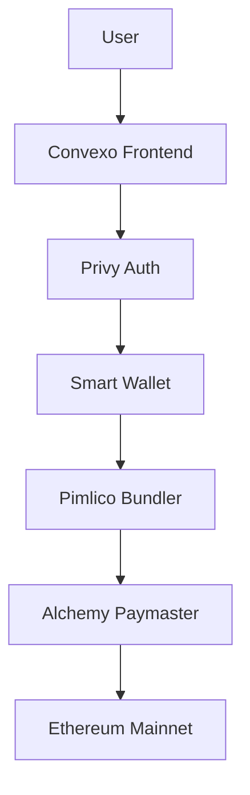

# 🚀 Convexo Smart Wallet

A next-generation Web3 wallet with gasless transactions, social authentication, and seamless UX. Built with Privy for smart wallet creation and Alchemy for gas sponsorship on Ethereum mainnet.


## ✨ Features

### 🔐 Smart Wallet Technology
- **Gasless Transactions**: Sponsored by Alchemy paymaster
- **Account Abstraction**: ERC-4337 compliant smart wallets
- **Social Authentication**: Email, SMS, Google, Apple login
- **Ethereum Mainnet**: Full production ready

### 🛡️ Security & Recovery
- **Social Recovery**: Email and phone-based recovery
- **Private Key Export**: Full wallet control when needed
- **Secure Infrastructure**: Privy authentication + Pimlico bundler

### 🎨 User Experience
- **One-Click Onboarding**: No seed phrases required
- **Modern UI**: Responsive design with Tailwind CSS
- **Real-time Updates**: Live wallet status and transactions
- **Multi-device Sync**: Access from anywhere

## 🏗️ Architecture



### Tech Stack
- **Frontend**: Next.js 14, React, TypeScript
- **Styling**: Tailwind CSS, Shadcn/ui
- **Authentication**: Privy SDK
- **Smart Wallets**: ERC-4337 Account Abstraction
- **Gas Sponsorship**: Alchemy Paymaster
- **Bundler**: Pimlico
- **Network**: Ethereum Mainnet (Chain ID: 1)

## 🚀 Quick Start

### Prerequisites
- Node.js 18+ 
- npm or yarn
- Privy account with smart wallets enabled
- Alchemy account with paymaster configured

### Installation

1. **Clone the repository**
   ```bash
   git clone https://github.com/Convexo-finance/convexus.git
   cd convexus
   ```

2. **Install dependencies**
   ```bash
   npm install
   ```

3. **Environment Setup**
   Create a `.env.local` file:
   ```env
   # Privy Configuration
   NEXT_PUBLIC_PRIVY_APP_ID=your_privy_app_id
   PRIVY_APP_SECRET=your_privy_app_secret

   # Alchemy Paymaster
   NEXT_PUBLIC_ALCHEMY_API_KEY=your_alchemy_api_key
   NEXT_PUBLIC_ALCHEMY_POLICY_ID=your_alchemy_policy_id

   # Pimlico Bundler
   NEXT_PUBLIC_PIMLICO_BUNDLER_URL=https://public.pimlico.io/v2/1/rpc
   NEXT_PUBLIC_PIMLICO_PAYMASTER_URL=https://public.pimlico.io/v2/1/rpc
   ```

4. **Run development server**
   ```bash
   npm run dev
   ```

5. **Open your browser**
   Navigate to `http://localhost:3000`

## 🌐 Vercel Deployment

### One-Click Deploy

[](https://vercel.com/new/clone?repository-url=https://github.com/Convexo-finance/convexus)

### Manual Deployment

1. **Connect to Vercel**
   ```bash
   npm install -g vercel
   vercel login
   ```

2. **Deploy**
   ```bash
   vercel --prod
   ```

3. **Environment Variables**
   Add the following environment variables in your Vercel dashboard:
   - `NEXT_PUBLIC_PRIVY_APP_ID`
   - `PRIVY_APP_SECRET`
   - `NEXT_PUBLIC_ALCHEMY_API_KEY`
   - `NEXT_PUBLIC_ALCHEMY_POLICY_ID`
   - `NEXT_PUBLIC_PIMLICO_BUNDLER_URL`
   - `NEXT_PUBLIC_PIMLICO_PAYMASTER_URL`

## ⚙️ Configuration

### Privy Smart Wallet Setup

1. **Enable Smart Wallets** in your Privy dashboard
2. **Configure Chains**: Add Ethereum mainnet (Chain ID: 1)
3. **Set Bundler URL**: `https://public.pimlico.io/v2/1/rpc`
4. **Configure Paymaster**: Use your Alchemy paymaster URL

### Alchemy Paymaster Setup

1. **Create Alchemy Account** and get API key
2. **Configure Gas Manager** with a sponsorship policy
3. **Set Policy Rules** for your smart wallet transactions
4. **Get Policy ID** from your Alchemy dashboard

## 📱 Usage

### For Users

1. **Connect Wallet**: Choose your preferred authentication method
2. **Create Smart Wallet**: Automatically created on first login
3. **Gasless Transactions**: Send transactions without ETH for gas
4. **Export Private Key**: Full control when needed

### For Developers

```javascript
import { usePrivy, useWallets } from '@privy-io/react-auth';

function MyComponent() {
  const { authenticated, login, logout } = usePrivy();
  const { wallets } = useWallets();
  
  // Your smart wallet logic here
}
```

## 🔧 Development

### Project Structure
```
convexus/
├── app/
│   ├── components/
│   │   ├── header.tsx
│   │   ├── login-card.tsx
│   │   ├── privy-smart-wallet.tsx
│   │   └── ...
│   ├── layout.tsx
│   ├── page.tsx
│   └── providers.tsx
├── config.ts
├── public/
└── ...
```

### Key Components
- **`providers.tsx`**: Privy configuration and context
- **`privy-smart-wallet.tsx`**: Main wallet dashboard
- **`login-card.tsx`**: Authentication interface
- **`header.tsx`**: Navigation and user status

### Custom Hooks
- **`usePrivy`**: Authentication and user management
- **`useWallets`**: Wallet management and operations

## 🧪 Testing

```bash
# Run tests
npm run test

# Run linting
npm run lint

# Type checking
npm run type-check
```

## 🚀 Production Checklist

- [ ] Environment variables configured
- [ ] Privy smart wallets enabled
- [ ] Alchemy paymaster configured
- [ ] Domain configured in Privy dashboard
- [ ] SSL certificate installed
- [ ] Analytics setup (optional)

## 📖 API Reference

### Privy Configuration
```typescript
{
  loginMethods: ['email', 'sms', 'google', 'apple'],
  smartWallet: {
    chains: [1], // Ethereum mainnet
    bundlerUrl: 'https://public.pimlico.io/v2/1/rpc',
    paymasterUrl: 'https://paymaster.alchemy.com/api/v1/{API_KEY}',
    paymasterContext: {
      policyId: 'your_policy_id',
    },
  },
}
```

## 🤝 Contributing

1. Fork the repository
2. Create a feature branch: `git checkout -b feature/my-feature`
3. Commit changes: `git commit -am 'Add my feature'`
4. Push to branch: `git push origin feature/my-feature`
5. Submit a pull request

## 📄 License

This project is licensed under the MIT License - see the [LICENSE](LICENSE) file for details.

## 🔗 Links

- **Live Demo**: [convexus.vercel.app](https://convexus.vercel.app)
- **Documentation**: [docs.convexo.finance](https://docs.convexo.finance)
- **Support**: [support@convexo.finance](mailto:support@convexo.finance)

## 🙋‍♂️ Support

Need help? We're here for you:

- 📧 Email: [support@convexo.finance](mailto:support@convexo.finance)
- 💬 Discord: [Join our community](https://discord.gg/convexo)
- 🐦 Twitter: [@ConvexoFinance](https://twitter.com/ConvexoFinance)

---

**Made with ❤️ by the Convexo team**
