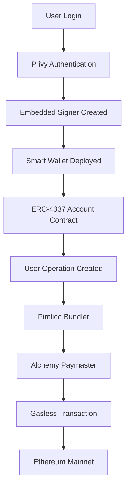

# 🚀 Convexo Smart Wallet Setup Guide

This guide will walk you through setting up **Privy EVM Smart Wallets** with **Alchemy gas sponsorship** for the Convexo application, based on the [official Privy documentation](https://docs.privy.io/wallets/using-wallets/evm-smart-wallets/overview).

## 📋 Prerequisites

- ✅ Privy account with smart wallets enabled
- ✅ Alchemy account with Gas Manager configured  
- ✅ Working Next.js application (this repo)

## 🔧 Step 1: Privy Dashboard Configuration

### Enable Smart Wallets

1. **Go to your [Privy Dashboard](https://dashboard.privy.io)**
2. **Navigate to "Smart Wallets" section**
3. **Enable smart wallets** for your application
4. **Select Ethereum Mainnet (Chain ID: 1)** as your target chain

### Configure Account Implementation

Choose your preferred ERC-4337 account implementation:
- ✅ **Recommended**: **LightAccount (Alchemy)** - for seamless Alchemy integration
- Alternative options: Kernel (ZeroDev), Safe, Biconomy, Thirdweb, Coinbase Smart Wallet

### Set Paymaster URL

1. **In the Privy Dashboard**, find the **"Paymaster URL"** field
2. **Enter your Alchemy paymaster URL**:
   ```
   https://paymaster.alchemy.com/api/v1/[YOUR_ALCHEMY_API_KEY]
   ```
3. **Add paymaster context** (if required):
   ```json
   {
     "policyId": "YOUR_ALCHEMY_POLICY_ID"
   }
   ```

### Configure Bundler URL

1. **Set the bundler URL** to:
   ```
   https://public.pimlico.io/v2/1/rpc
   ```
   (This is Pimlico's public bundler for Ethereum mainnet)

## 🏦 Step 2: Alchemy Gas Manager Setup

### Create Sponsorship Policy

1. **Go to [Alchemy Dashboard](https://dashboard.alchemy.com)**
2. **Navigate to "Gas Manager"**
3. **Create a new sponsorship policy**
4. **Configure policy rules**:
   - **Chain**: Ethereum Mainnet (1)
   - **Spending rules**: Set your budget limits
   - **Allowed addresses**: Configure which contracts can be sponsored
   - **Gas limits**: Set maximum gas per transaction

### Get Configuration Values

From your Alchemy dashboard, collect:
- ✅ **API Key**: `NEXT_PUBLIC_ALCHEMY_API_KEY`
- ✅ **Policy ID**: `NEXT_PUBLIC_ALCHEMY_POLICY_ID`
- ✅ **Paymaster URL**: `https://paymaster.alchemy.com/api/v1/[API_KEY]`

## 🌐 Step 3: Environment Configuration

Update your `.env.local` file:

```env
# Privy Configuration (for smart wallet creation)
NEXT_PUBLIC_PRIVY_APP_ID=cm9rk4vv101rfl80ldym9amg2
PRIVY_APP_SECRET=2vK4f39cu6dSWFgHy8Ru35jgGRBd7kYit2e9G3PQuaYMMsLGa5UUgC5DTAbdi4YhQqMLqUC1ZQfSJvQMAjEJoaN1

# Alchemy Gas Sponsorship (for paymaster)
NEXT_PUBLIC_ALCHEMY_API_KEY=wkftoNwmx1w1I2Zo3Kljuv0T28pCBQy0
NEXT_PUBLIC_ALCHEMY_POLICY_ID=eb98cd1a-4c00-4fe3-8e36-b3eedd6818de

# Bundler Configuration (for transaction submission)
NEXT_PUBLIC_PIMLICO_BUNDLER_URL=https://public.pimlico.io/v2/1/rpc
NEXT_PUBLIC_PIMLICO_PAYMASTER_URL=https://public.pimlico.io/v2/1/rpc
```

## 🎯 Step 4: Smart Wallet Architecture

### How It Works



### Key Components

1. **Privy Embedded Signer**: Controls the smart wallet
2. **ERC-4337 Smart Contract**: Holds user assets and executes operations
3. **Pimlico Bundler**: Submits user operations to the network
4. **Alchemy Paymaster**: Sponsors gas fees for transactions
5. **Ethereum Mainnet**: Final settlement layer

## 🧪 Step 5: Testing Smart Wallet Features

### Test Authentication
1. **Run the application**: `npm run dev`
2. **Navigate to**: `http://localhost:3000`
3. **Login with**: Email, SMS, Google, or Apple
4. **Verify**: Smart wallet is automatically created

### Test Gasless Transactions
1. **Connect your smart wallet**
2. **Initiate a transaction** (e.g., token transfer)
3. **Verify**: No ETH balance required for gas
4. **Check**: Transaction appears on Etherscan

### Verify Gas Sponsorship
1. **Check Alchemy Dashboard**: Gas Manager usage
2. **Monitor spending**: Policy limits and usage
3. **Review transactions**: In Etherscan with paymaster

## 🔍 Step 6: Verification Checklist

### Privy Dashboard ✅
- [ ] Smart wallets enabled
- [ ] Ethereum mainnet configured
- [ ] LightAccount (Alchemy) selected
- [ ] Paymaster URL configured
- [ ] Bundler URL set to Pimlico

### Alchemy Dashboard ✅
- [ ] Gas Manager enabled
- [ ] Sponsorship policy created
- [ ] Budget limits configured
- [ ] API key generated
- [ ] Policy ID obtained

### Application ✅
- [ ] Environment variables set
- [ ] Build successful (`npm run build`)
- [ ] Authentication working
- [ ] Smart wallets creating
- [ ] Gasless transactions executing

## 🚀 Step 7: Production Deployment

### Vercel Configuration

1. **Deploy to Vercel**: 
   ```bash
   vercel --prod
   ```

2. **Set Environment Variables** in Vercel dashboard:
   - `NEXT_PUBLIC_PRIVY_APP_ID`
   - `PRIVY_APP_SECRET`
   - `NEXT_PUBLIC_ALCHEMY_API_KEY`
   - `NEXT_PUBLIC_ALCHEMY_POLICY_ID`
   - `NEXT_PUBLIC_PIMLICO_BUNDLER_URL`
   - `NEXT_PUBLIC_PIMLICO_PAYMASTER_URL`

3. **Update Privy Dashboard**:
   - Add your production domain
   - Configure CORS settings
   - Update callback URLs

## 🔧 Troubleshooting

### Common Issues

**Smart Wallet Not Creating**
- Verify Privy app ID is correct
- Check smart wallets are enabled in dashboard
- Ensure Ethereum mainnet is configured

**Gas Sponsorship Not Working**  
- Verify Alchemy policy ID is correct
- Check paymaster URL format
- Ensure policy has sufficient balance
- Review policy spending rules

**Transactions Failing**
- Check bundler URL is correct
- Verify network (Chain ID: 1)
- Ensure policy allows the transaction type
- Check gas limits in policy

### Debug Commands

```bash
# Check build
npm run build

# Run in development  
npm run dev

# Check environment variables
printenv | grep NEXT_PUBLIC

# Verify TypeScript
npm run type-check
```

## 📚 Additional Resources

- [Privy Smart Wallets Documentation](https://docs.privy.io/wallets/using-wallets/evm-smart-wallets/overview)
- [Alchemy Gas Manager Guide](https://docs.alchemy.com/docs/gas-manager-services)
- [ERC-4337 Account Abstraction](https://eips.ethereum.org/EIPS/eip-4337)
- [Pimlico Bundler Documentation](https://docs.pimlico.io/)

## 🆘 Support

Need help? Contact:
- 📧 **Email**: support@convexo.finance
- 💬 **Discord**: [Convexo Community](https://discord.gg/convexo)
- 🐦 **Twitter**: [@ConvexoFinance](https://twitter.com/ConvexoFinance)

---

**🎉 Congratulations! Your Convexo Smart Wallet is now ready for gasless transactions on Ethereum mainnet!** 